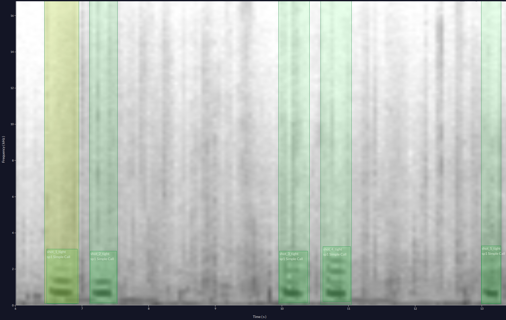
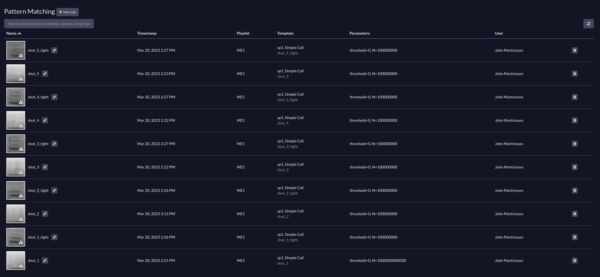

# Evaluate pattern matching in Arbimon on DCASE 2022

This is an evaluation of the pattern matching method in Arbimon on the DCASE
2022 dataset.

## Pattern Matching

TODO: is there a technical description of the "pattern matching" method?

My understanding of the pattern matching method is that it simply does per-pixel
correlation between the template and query templates in the dataset.

That is, it is a template matching method.

## Annotations in Arbimon

I have manually entered the 5-shot annotations from the DCASE 2022 validation
dataset into Arbimon. Unfortunately, I found no way to exactly adjust the
templates so that they match the timings of the annotations. I have entered them
as best as I could.

In the DCASE challenge we only have timings for the 5-shot, no information on
the frequency range, but I have also added templates which I call "tight", where
I have to the best of my ability made a tight template of the sounds. E.g., "shot_1_tight" would be the tight template for the first annotation in the validation data file.

This is an example for the ME1.wav file.

## Query in Arbimon

I simply create a job for each template [shot_1, shot_2, ..., shot_5], and [shot_1_tight, shot_2_tight, ..., shot_5_tight] for the corresponding file, e.g., ME1.wav, where the maximum number of detections per file is set to N=100000000, and the threshold is set to threshold=0.0. This means that we get all the queries with corresponding scores in the results. The results are exported as a .csv.

## Evaluation

A positive detection by a template is defined as a score higher than a pre-defined threshold. Each template makes a vote for each query on whether or not it contains a positive event.

### Method 1

Each template scores each query, a positive detection is defined as a query for which any of the templates has given a score higher than a given threshold.

### Method 2

Each template scores each query, and for each query we average the scores. A positive detection is defined as a query with an average score higher than a given threshold.

### Results 1

### Results 2
